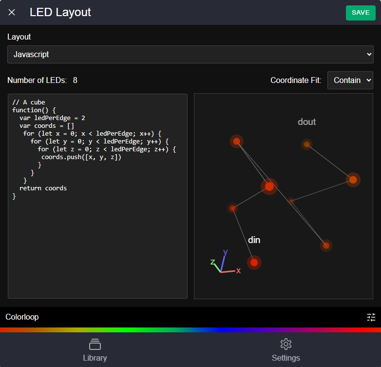

esp-spatial-led
===========
Software to control LEDs that are arranged in 3 dimensional space for ESP processors. Includes:
- A way to map each LED in [x,y,z] space with arrays or javascript code
- Live 3d visualization preview of LED layout
- Sample animations that are spatially aware and work out of the box
- Ability to create new animations with controllable parameters
- C++ classes for 3d transformations to implement new custom spatial animations easily
- A website served from the microcontroller to configure the LED setup and control playback

The project is built on FastLED and ESPAsyncWebServer

## Installation

- Install vscode with platform io
- Install node
- Clone the github repository
- Open in vscode, select your platform, build and upload to your microcontroller

If you don't see your platform listed, open platformio.ini and add an [env] block with your microcontroller

## Hardware Configuration

Until configuration of output pin, LED chipset and RGB order is offered in the web UI, you will need to set these in the code.

Open /src/Services/LedDriver.cpp

Find the lines at the top of the file to #define your DATA_PIN, CHIPSET, RGB_ORDER

```cpp
#define DATA_PIN D4
#define CHIPSET WS2812B
#define RGB_ORDER GRB
```

## LED Setup

Once you have uploaded the software to your microcontroller, find the WiFi network labeled "SPATIAL-LED" and connect to it.

Open a browser and go to: 192.168.4.1

You will see the configuration website open to the animation library page.

Click the "Settings" navigation in the bottom right of the page and click "LED Layout".

You have two options to configure your LED layout: A simple led strip with a number of leds, or a 3d mapped layout.

Pick Javascript as the layou type and enter your layout into the code box. A layout can be either an array of [x,y,z] points:

```javascript
// A cube
[
  [0,0,0],
  [0,1,0],
  [0,1,1],
  [0,0,1],
  [1,0,1],
  [1,1,1],
  [1,1,0],
  [1,0,0]
]
```

Or you can use a function that returns the layout:

```javascript
// A cube
function() {
  var ledPerEdge = 2
  var coords = []
   for (let x = 0; x < ledPerEdge; x++) {
     for (let y = 0; y < ledPerEdge; y++) {
       for (let z = 0; z < ledPerEdge; z++) {
        coords.push([x, y, z])
       }
     }
   }
  return coords
}
```

